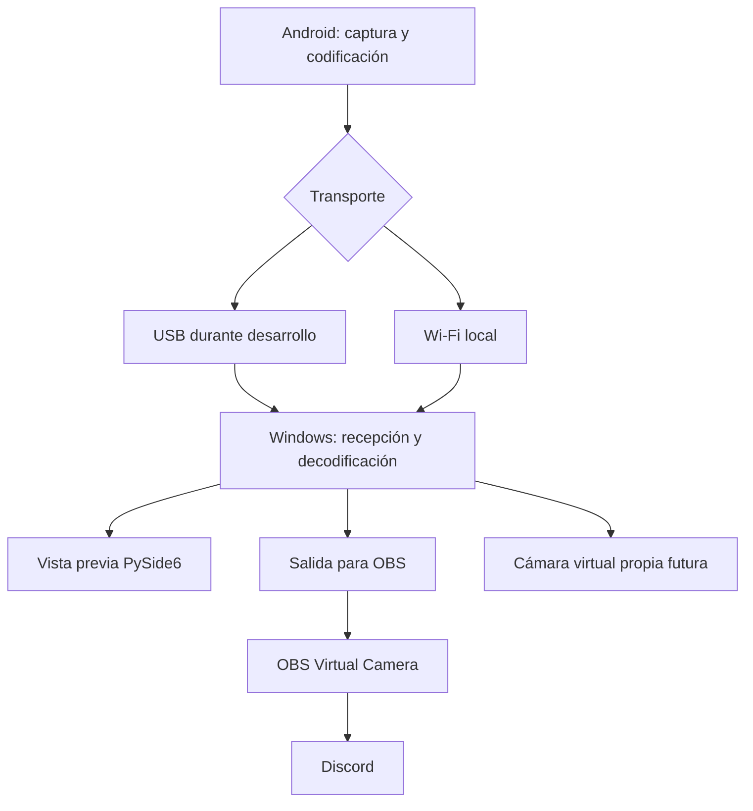

# Arquitectura conceptual

## Principios

- **Operación local:** el video permanece entre el teléfono, el PC y las aplicaciones locales; no se requieren hosting, backend web, nube ni servicios externos.
- **Baja latencia:** las decisiones de captura, codificación, transporte y reproducción priorizarán una experiencia interactiva.
- **Módulos desacoplados:** captura, codificación, transporte, recepción, decodificación, presentación e integraciones externas mantendrán responsabilidades separadas.
- **Capacidades en tiempo de ejecución:** la aplicación consultará las capacidades reales antes de ofrecer perfiles.
- **Compatibilidad basada en evidencia:** no se asumirá que todos los teléfonos soportan las mismas resoluciones, FPS o códecs; 1080p60 es un objetivo condicionado, no una garantía.

## Componentes y responsabilidades

### Aplicación Android

Será responsable de seleccionar la cámara, capturar sus imágenes, adaptar orientación y perfil, codificar el video y enviarlo. Su stack inicial será Kotlin, Jetpack Compose, CameraX, MediaCodec, Kotlin Coroutines y Flow.

### Transporte

Durante el desarrollo, USB usará ADB para habilitar un transporte TCP. Wi-Fi operará dentro de la red local. Ambos medios deberán reutilizar un protocolo común cuando sea técnicamente viable, de modo que el transporte no se mezcle con la captura o la decodificación. La dependencia de ADB se sustituirá más adelante por una solución USB apta para usuarios finales.

### Aplicación Windows

Será responsable de establecer la sesión, recibir el stream, decodificarlo, reproducir la vista previa, exponer métricas y preparar la salida hacia OBS. Se emplearán Python para iterar sobre el producto, PySide6 para la interfaz y GStreamer para recepción, decodificación y reproducción. OpenCV solo se incorporará si surge una necesidad concreta; Pytest se reserva para pruebas futuras. PyInstaller y Nuitka quedan por evaluar y la versión de Python no se fijará hasta validar la compatibilidad del conjunto.

Python permite desarrollar con rapidez la aplicación y mantener separada la lógica de producto. C++ se reserva para la futura integración nativa con Windows, donde las API, el rendimiento y la distribución de una cámara virtual pueden exigirlo.

### Cámara virtual e integración externa

La cámara virtual no es la aplicación Windows ni forma parte del primer MVP. En el MVP, Windows entregará una salida a OBS; **OBS Virtual Camera será el puente hacia Discord**. Una cámara virtual propia compatible con Windows 10 se estudiará después en C++. Para Windows 11 se evaluará posteriormente `MFCreateVirtualCamera`, y solo se adoptará si aporta ventajas verificables.

## Flujo del video

El flujo separa la producción del video, el medio de transporte, su consumo en Windows y las salidas externas. Esta separación permitirá cambiar el mecanismo USB, reutilizar el protocolo mediante Wi-Fi o sustituir el puente de OBS sin rediseñar el sistema completo.

## MVP frente al producto futuro

| MVP | Evolución posterior |
| --- | --- |
| Android y Windows conectados localmente | Mayor cobertura comprobada de dispositivos y Windows 11 |
| USB con ADB/TCP y Wi-Fi local | USB apto para usuarios finales sin ADB |
| Vista previa y métricas | Controles remotos y experiencia publicable |
| OBS + OBS Virtual Camera hacia Discord | Cámara virtual propia de Windows |

La arquitectura inicial no incluye audio, cuentas, autenticación, base de datos, telemetría, hosting, backend, servicios externos ni transmisión por Internet.
